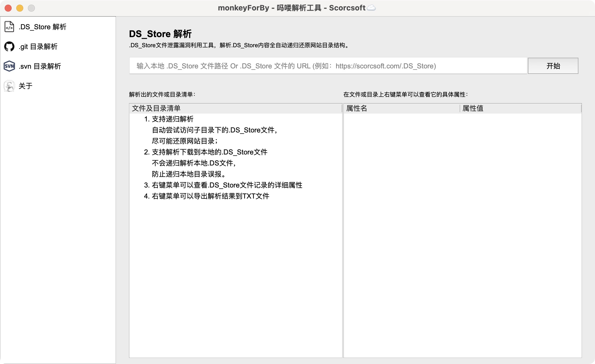

# forBy
一款图形化的 .DS_Store文件泄露、.git目录泄露、.svn目录泄露漏洞利用工具。

# 开始使用
本工具使用Python3 + PyQt5开发，在开始使用前，请确保已经安装了相关模块：

<code lang="shell">
pip3 install -r requirements.txt
</code>

# 如果你无法正常安装第三方模块，请查看Release中已经打包好的可执行文件。

# .DS_Store 模块
## 什么是 .DS_Store ？
.DS_Store 是 macOS 系统自动生成的隐藏文件，全称是 “Desktop Services Store”。它主要用于在文件夹中记录该文件夹的显示偏好，比如：
- 图标的位置和大小
- 文件夹的视图模式（图标、列表、分栏、画廊）
- 排序方式（按名称、日期、类型等）
- 背景图片（如果有设置）

## 什么是 .DS_Store 文件泄露漏洞？
.DS_Store 文件泄露漏洞是指，开发者使用Mac系统进行编码，或者网站源代码目录结构中存在 .DS_Store 文件。
在开发完成后没有及时删除掉 .DS_Store 文件就将代码部署到服务器，导致 .DS_Store 文件被一并上传到了服务器。

## .DS_Store 文件泄露怎样利用？
通过解析 .DS_Store 文件，可以还原出网站的目录结构，例如：当前目录下有哪些文件、有哪些子目录。

## .DS_Store 文件的注意事项？
注意📢：.DS_Store 文件并不会100%的记录完整的目录结构！！！也并非所有目录都会自动生成 .DS_Store文件！！！

也就是说，假设 root 目录下实际存在"1.txt"、"2.txt"、"3.txt"和子目录"sub directory"，
但是 .DS_Store 文件中可能只记录了 root 目录下只有一个"1.txt"，这都是正常情况！！！

其具体原理与 .DS_Store 文件的生成有关。例如：
1. 使用系统命令 mkdir 创建了子目录，但是从未使用Finder打开该子目录，则该子目录必定不存在 .DS_Store
2. 使用系统命令或在Finder中右键菜单创建了子目录，也使用Finder打开过该子目录，但是没有在Finder中调整过该子目录的图标的位置和大小、文件夹的视图模式、排序方式等信息，则该子目录基本上也不会生成 .DS_Store 文件
3. 某目录已经存在 .DS_Store 文件，随后使用cp、touch或者浏览器下载等方式向该目录中创建/新增了文件，则 .DS_Store 文件中基本也不会记录这个新增的文件。

## forBy 的 .DS_Store 模块
.DS_Store 模块的作用是递归解析泄露的.DS_Store文件，还原目录结构。本模块支持直接输入 .DS_Store 文件的URL地址，也支持解析下载到本地的 .DS_Store 文件。

当运行脚本后，你应该能看到如下界面：

</img>

### 解析网站上的 .DS_Store (支持递归)
左侧菜单选取 .DS_Store 解析模块，进入 .DS_Store 解析功能。 在输入框中输入已知的 .DS_Store 文件的URL，例如：

<code lang="shell">
http://127.0.0.1:8000/.DS_Store
</code>

然后点击开始按钮 .DS_Store 解析模块就会尝试下载并递归解析 .DS_Store 文件，尽可能还原网站目录：

### 解析已经下载到本地的 .DS_Store (不支持递归)
如果你已经将 .DS_Store 文件下载到本地，也可以解析本地的 .DS_Store 文件，只需要输入文件路径即可：

## 为什么解析本地文件不支持递归解析？
这是因为 .DS_Store 文件只会记录当前目录的目录结构，而无法记录当前目录下的子目录内的结构。

递归解析的原理是：
1. 解析 .DS_Store 文件，如果发现存在子目录：sub_directory_1
2. 自动组装URL地址：http://doamin/sub_directory_1/.DS_Sotre 并尝试访问
3. 对 sub_directory_1下的 .DS_Store 进行解析，并重复第1、2步

所以，如果是已经下载到了本地的 .DS_Store 文件，即使识别到了当前目录下的子目录，也无法读取到子目录下的 .DS_Store 文件，因为子目录下的.DS_Store 文件在本地根本不存在，所以也就无法递归还原了。

## 查看文件/目录属性
在左侧的目录结构树中的右键菜单支持查看 .DS_Store 文件中记录的文件和子目录的属性：

## 导出解析结果
本工具支持导出解析结果，保存到本地文件：

查看导出的解析结果：

